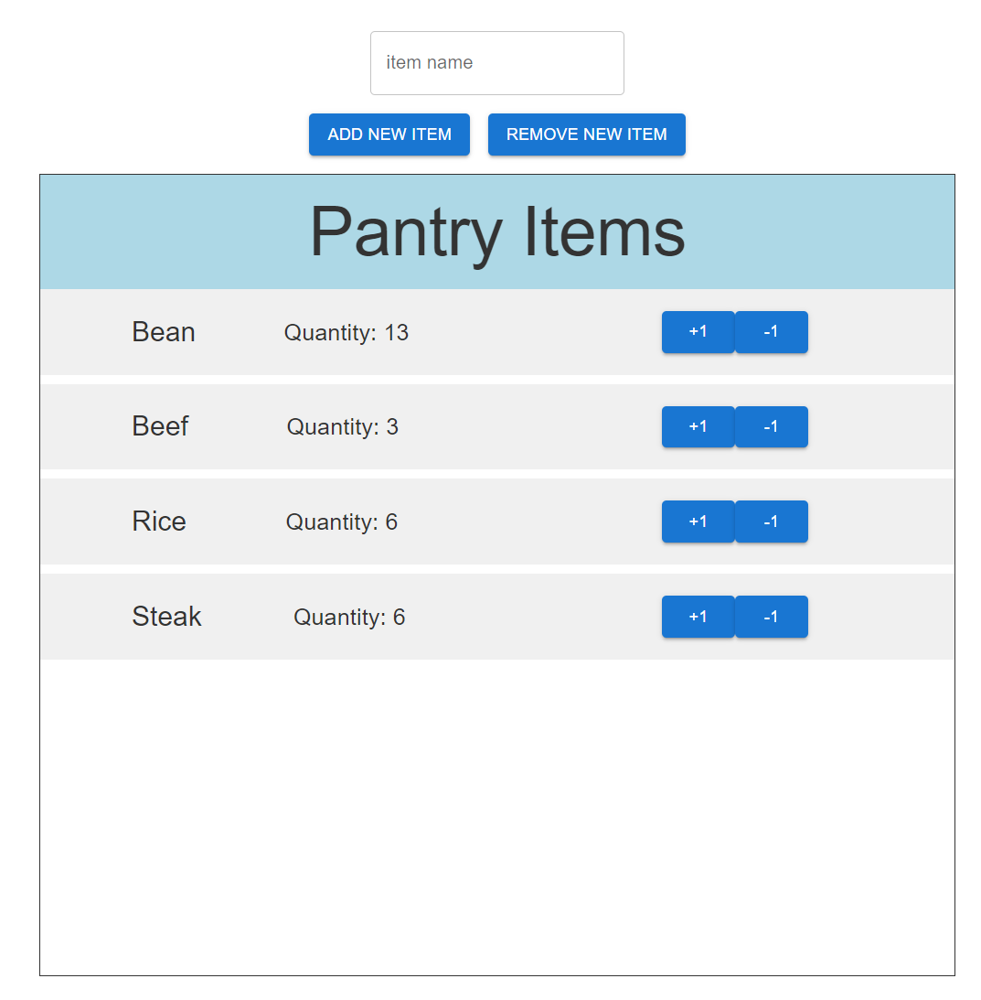

# Pantry Inventory

## About
Using this application, keep track of items in a pantry. Items are stored on a database and are shared across all instances.
Developed during the 2024 Headstarter Fellowship.

## Features
* Items can be added or removed using the ADD NEW ITEM or REMOVE NEW ITEM buttons
* Items can also be increased or decreased in small increments using the +1 or -1 buttons
* Items can be searched for using the search bar on the top

## Details
Built using Next.JS, Material UI components, and Google Firebase.
Hosted on netlify.

Based on [Bill Zhang's article](https://medium.com/@billzhangsc/building-an-inventory-management-app-with-next-js-react-and-firebase-e9647a61eb82) on building an inventory app.

*This application served as an introductory project for learning web development.*
